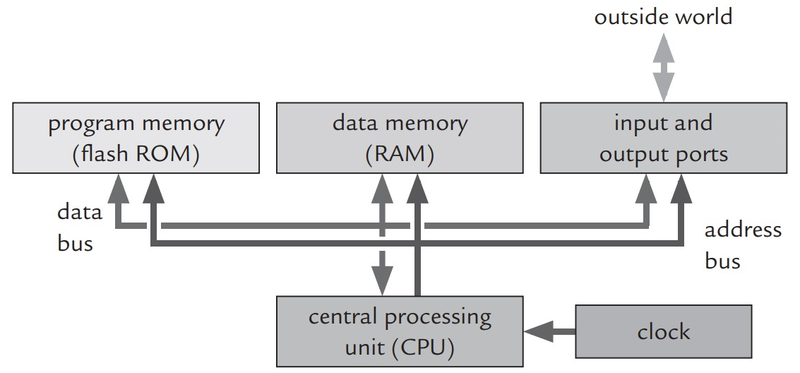

## 1. Introdução à microcontroladores

#### 1.1. O que são?

De maneira prática, um microcontrolador é um pequeno computador capaz de executar instruções pré-programadas, entretanto é construído em apenas um circuito integrado que contém todos os subsistemas necessários para seu  funcionamento, dentre eles a unidade de processamento central (CPU, sigla para Central Processing Unit), a memória e os periféricos programáveis de entrada e saída.

<div align="center">
    
</div>

#### 1.2. Aplicações

Microcontroladores são utilizados em praticamente qualquer dispositivo automatizado, isso pode incluir sistemas de controle de automóvel, dispositivos médicos implantáveis, controles remoto, máquinas de escritório, eletrodomésticos, ferramentas elétricas, brinquedos, entre muitos outros.

#### 1.3. Conceitos básicos

**1.3.1. Unidade de Processamento Central (CPU)**

- Executam instruções, logicas e aritméticas. ```ULA```
- Contém registradores, memórias de fácil e rápido acesso para a CPU.
- Registradores importantes:
    - **PC**  (Program Counter): ```posição atual na sequência de execução de um processo```
    - **SP** (Stack Pointer): ```acompanhar a pilha de chamadas```
    - **SR** (Status Register): ```registro de status```
- Além de outros componentes para decodificação, resets e interrupções.
- O conjunto de instruções varia de acordo com o microcontrolador.
- Arquiteturas:
    - **RISC** (Reduced Instruction Set Computer): ```- instruções``` ```+ ciclos```
    - **CISC** (Complex Instruction Set Computer): ```+ instruções``` ```- ciclos```

**1.3.2. Memórias**

- **RAM** (Random Access Memory): ```+ rápidas``` ```voláteis```
- **ROM** (Read-only memory): ```não voláteis```

**Comparação de memórias**

<div align="center">
    
</div>

*[Mais informações sobre memórias](https://embedded.fm/blog/2016/3/1/embedded-wednesdays-thanks-for-the-memories)*

**Arquiteturas**

<div align="center">

von Neumann             |  Harvard
:-------------------------:|:-------------------------:
  |  

</div>

**1.3.3. Principais periféricos**

- Portas de entrada e saída
- Osciladores e geradores de clock
- Temporizadores/contadores
- Watchdog timer
- Conversores Analógico/Digital
- Interfaces de comunicação

#### [2. ATmega328p](02-atmega328p.md)