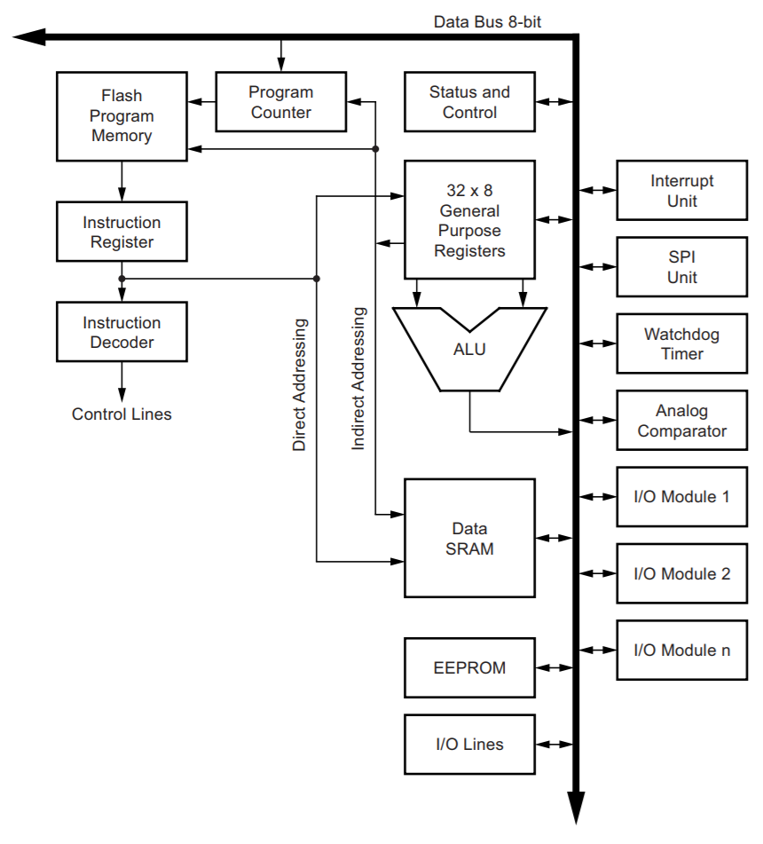
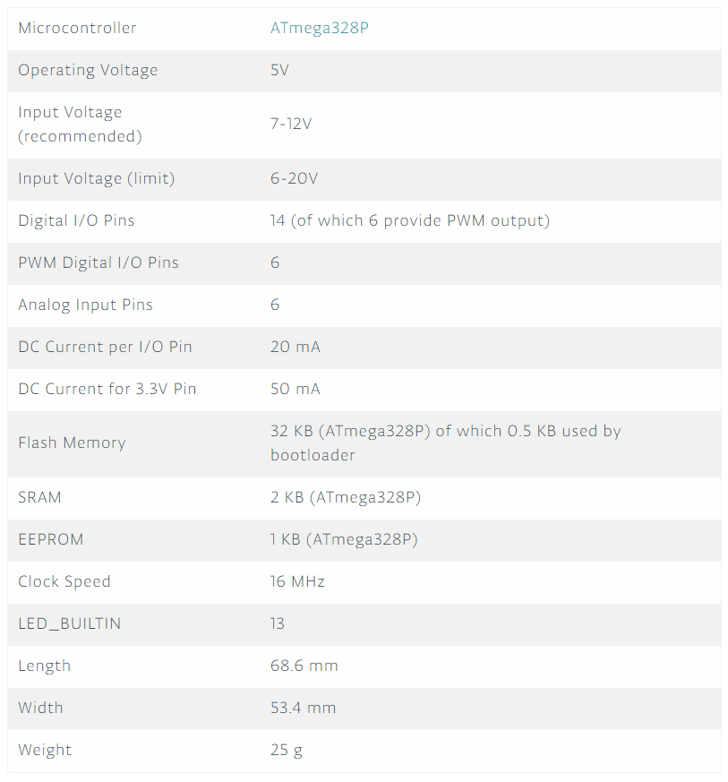
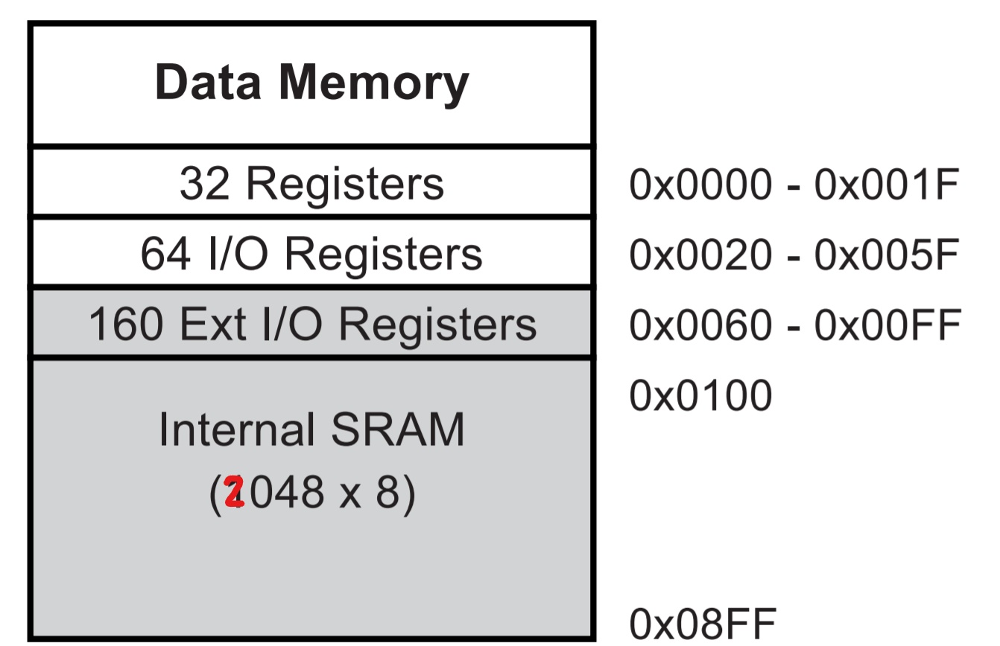
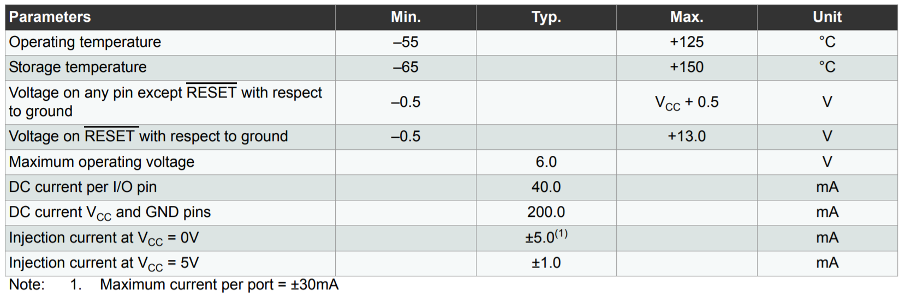
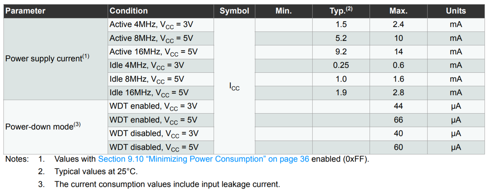

## 2. ATmega328p

#### 2.1. Diagrama de blocos

Diagrama geral do microcontrolador com todos seu componentes. O ```DATA BUS``` é responsável pelo acesso dos dados à dos os componentes.

<div align="center">
    
</div>

Estrura geral da CPU.

<div align="center">
    
</div>

#### 2.2. Especificações gerais

<div align="center">
    
</div>

**2.2.1. Memórias**

- **Endereçamento de memórias**

<div align="center">
    
</div>

- **Arquitetura:** Harvard Modificada => Instruções e dados no mesmo endereçamento.

**2.2.1. Características elétricas**

- **Classificações máximas absolutas**

<div align="center">
    
</div>

- **Características DC por modo de consumo**

<div align="center">
    
</div>

*Contém 6 modos de consumo diferentes.*

#### [3. Entradas e Saídas](03-entradas-e-saidas.md)