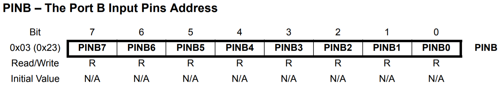

## 3. Entradas e Saídas

#### 3.1. Registradores

**DDRx:** Data Direction Register
São responsáveis por determinar se os pinos do PORT X se comportarão como *entrada* ou *saída*. Cada bit do registrador DDR controla o estado do respectivo pino.

<div align="center">
    
</div>

**PORTx**
São responsáveis por determinar se um pino está definido como alto (1) ou baixo (0).

<div align="center">
    
</div>

**PINx**
São responsáveis por guardar o estado lógico de uma porta configurada como entrada.

<div align="center">
    
</div>

```x -> porta a ser utilizada [B, C ou D]```

#### 3.2. Pull-Up e Pull-Down

 Configuração de ligação com interruptores onde um resistor, conectado ao interruptor, vai ser ligado ao GND (down) ou ao VCC do circuito (up). 

<div align="center">
    
</div>

Este tipo de configuração tem como objetivo garantir que entradas de sistemas lógicos se ajustem em níveis lógicos esperados no caso de dispositivos externos serem desconectados.

#### 3.3. Exemplos

**3.3.1. [Blink](https://www.tinkercad.com/things/5qbpJ6G2FTd-blink)**

Código simples para piscar um LED, utiliza o acesso direto aos registradores e um delay em assembly para minimizar o tamanho do programa gerado.

**3.3.2. [Button](https://www.tinkercad.com/things/bnZmdRDkNMo-button)**

Acionamento de um LED ao pressionar um botão. Utiliza o resistor de pull-up interno para garantir o nível lógico alto na entrada do Arduíno.


#### [4. Interrupções](04-interrupcoes.md)