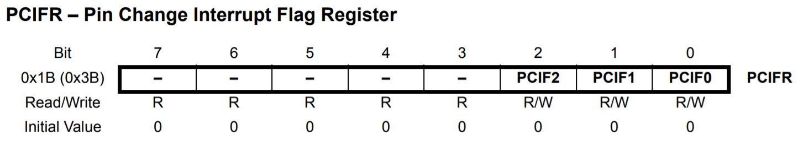

## 4. Interrupções

Interrupções são uma forma de responder a eventos "externos" enquanto você faz outra coisas. Devem ser utilizadas para tarefas pequenas.

#### 4.1. Tipos e Prioridades

```
 1  Reset 
 2  External Interrupt Request 0  (pin D2)          (INT0_vect)
 3  External Interrupt Request 1  (pin D3)          (INT1_vect)
 4  Pin Change Interrupt Request 0 (pins D8 to D13) (PCINT0_vect)
 5  Pin Change Interrupt Request 1 (pins A0 to A5)  (PCINT1_vect)
 6  Pin Change Interrupt Request 2 (pins D0 to D7)  (PCINT2_vect)
 7  Watchdog Time-out Interrupt                     (WDT_vect)
 8  Timer/Counter2 Compare Match A                  (TIMER2_COMPA_vect)
 9  Timer/Counter2 Compare Match B                  (TIMER2_COMPB_vect)
10  Timer/Counter2 Overflow                         (TIMER2_OVF_vect)
11  Timer/Counter1 Capture Event                    (TIMER1_CAPT_vect)
12  Timer/Counter1 Compare Match A                  (TIMER1_COMPA_vect)
13  Timer/Counter1 Compare Match B                  (TIMER1_COMPB_vect)
14  Timer/Counter1 Overflow                         (TIMER1_OVF_vect)
15  Timer/Counter0 Compare Match A                  (TIMER0_COMPA_vect)
16  Timer/Counter0 Compare Match B                  (TIMER0_COMPB_vect)
17  Timer/Counter0 Overflow                         (TIMER0_OVF_vect)
18  SPI Serial Transfer Complete                    (SPI_STC_vect)
19  USART Rx Complete                               (USART_RX_vect)
20  USART, Data Register Empty                      (USART_UDRE_vect)
21  USART, Tx Complete                              (USART_TX_vect)
22  ADC Conversion Complete                         (ADC_vect)
23  EEPROM Ready                                    (EE_READY_vect)
24  Analog Comparator                               (ANALOG_COMP_vect)
25  2-wire Serial Interface  (I2C)                  (TWI_vect)
26  Store Program Memory Ready                      (SPM_READY_vect)
```


#### 4.2. Registradores

**EICRA:** Este registrador é reponsável por configurar a interrupção externa no determinado pino. 

<div align="center">
    
</div>

<div align="center">
    
</div>

***

**EIMSK:** Este registrador é responsável por habilitar a interrupção externa no determinado pino.

<div align="center">
    
</div>

***

**EIFR:** Este registrador contém um flag que indica se a interrupção externa INTx foi chamada.

<div align="center">
    
</div>

***

**PCICR:** Este registrador é reponsável por habilitar a interrupção em um determinado PORT quando o respectivo bit PCIEx for setado para 1.

<div align="center">
    
</div>

***

**PCIFR:** Este registrador contém um flag que indica se ocorreu uma interrupção no PORTx.
<div align="center">
    
</div>

***

**PCMSKx:** Este registrador é responsável por habilitar a interrupção de um pino  em um determinado PORT. Logo, existem 3 registradores desse tipo PCMSK0, PCMSK1 e PCMSK2 referentes aos PORTS B, C e D respectivamente.

<div align="center">
    
</div>

#### 4.3. Extra

**4.3.1. Habilitando interrupções**

```
interrupts ();  // or ...
sei ();         // set interrupts flag
```

**4.3.2. Desabilitando interrupções**

```
noInterrupts ();  // or ...
cli ();           // clear interrupts flag
```

**4.3.3. Volatile**

Variáveis globais que são utilizadas em interrupções devem ser declaradoas como ```volatile```. Isso avisa ao compildador que está variável pode mudar a qualquer momento. 

#### 4.4. Exemplos

**4.4.1. [Interrupt 1](https://www.tinkercad.com/things/bZVZxxljQNx-interrupt-1)**

Interrupção externa utilizando funções do Arduíno.

**4.4.2. [Interrupt 2](https://www.tinkercad.com/things/hDWowurXvik-interrupt-2)**

Exemplo mais completo utilzando registradores.

#### 4.5. Desafio

Utilizando este [circuito](https://www.tinkercad.com/things/j05thzlvxOd-desafio-interrupcoes), codifique um programa que executa uma contagem (0 à 7) e mostre esse valor em forma binária nos LEDs. Esta contagem deve funcionar da seguinte forma:

- A contagem deve ser incrementada ao pressionar o botão caso a chave esteja ativada.

- A contagem deve ser decrementada ao pressionar o botão caso a chave esteja desativada.

- Caso a contagem seja superior à 7 o valor é zerado.

- Caso a contagem seja inferior à 0 o valor volta para 7.

O programa deve utilizar interrupções e não deve executar nada na função ```void loop()```.

#### [5. Sistema de Clock e Modos de Repouso](05-clock.md)

