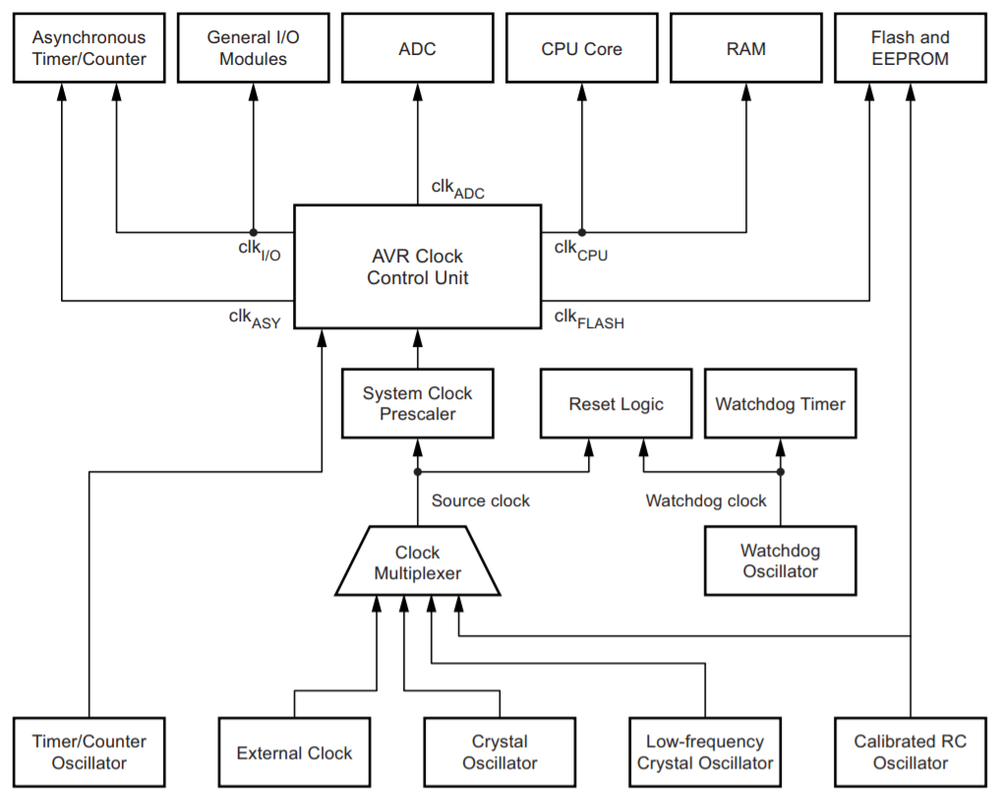
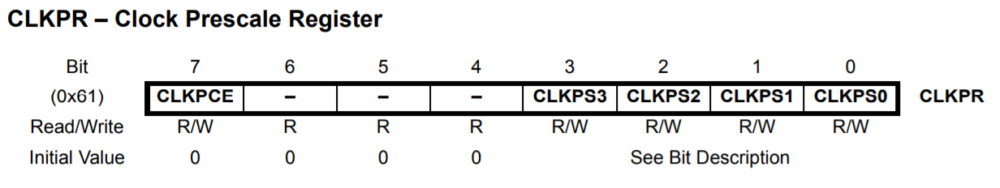
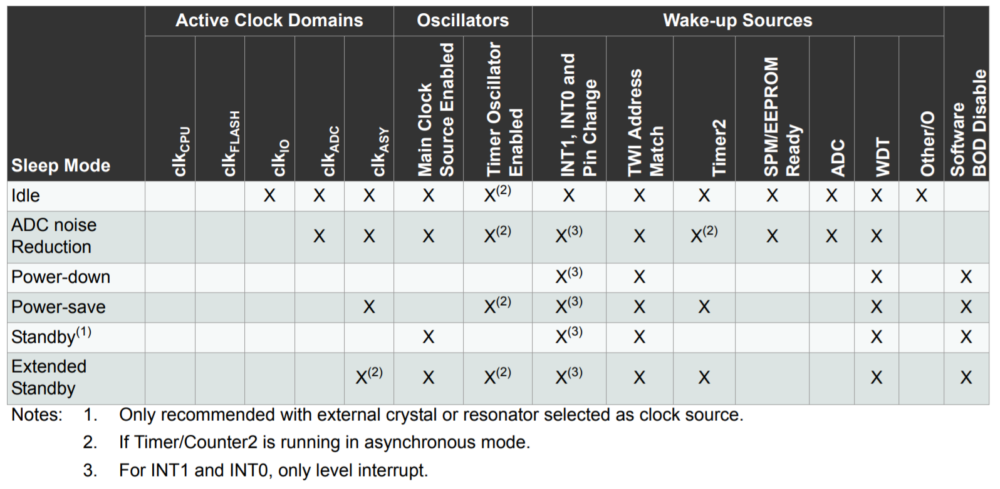

## 5. Sistema de Clock e Modos de Repouso

#### 5.1. Distribuição de Clock

<div align="center">
    
</div>

**5.1.1. Registrador**

<div align="center">
    
</div>

#### 5.2. Modos de baixo consumo

<div align="center">
    
</div>

**5.2.1. Consumo**

|     Modo    | Consumo (mA) |
|:-----------:|:------------:|
|     Idle    |      15      |
|     ADC     |      6.5     |
|  Power-Down |     0.36     |
|  Power-Save |     1.62     |
|   Standby   |     0.84     |
| Ext-Standby |     1.62     |

**5.2.2. Uso**

```set_sleep_mode (SLEEP_MODE_xxx);```


