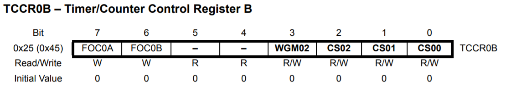

## 6. Contadores

O Arduíno conta com 3 timers que podem ser utilizados de diversas formas:

- Temporização
- Contagem de eventos externos
- Geração de sinais PWM
- Interrupções periódicas
- Medida de intervalos de pulsos

#### 6.1. Modos de Operação

**6.1.1. Normal**

- Gera interrupção  `TOVn` ao atingir o limite do contador
- Reinicia o contador no mesmo ciclo da interrupção

Frequência da Interrupção = F / (2 * N * (1 + TOP))

`F = Frequência do Arduino`
`N = Prescale`
`TOP = Limite do contador 255 (Timer0 e Timer2) ou 65535 (Timer1)`

**6.1.2. Clear Timer on Compare Match (CTC)**

- Gera interrupção  `OCFnA` ou `OCFnB` quando o contador é igual à `OCRnA` ou `OCRnA`, respectivamente.
- Reinicia o contador no mesmo ciclo da interrupção

Frequência da Interrupção = F / (2 * N * (1 + OCRnx))

`F = Frequência do Arduino`
`N = Prescale`
`OCRnx = Valor do registrador de comparação (A ou B) do Timer n`

**6.1.3. Fast PWM**
*Timer0 e Timer2*

- Gera interrupção  `TOVn` ao atingir o limite do contador
- Gera interrupção  `OCFnA` ou `OCFnB` quando o contador é igual à `OCRnA` ou `OCRnA`, respectivamente.
- Reinicia a contagem ao atingir o limite do contador.

Frequência da Interrupção = F / (N * 256)

`F = Frequência do Arduino`
`N = Prescale`

**6.1.4. Outros**

- Fast PWM *(Timer1)*
- Phase Correct PWM
- Phase and Frequency Correct PWM Mode `Timer1`

#### 6.2. Timer0

- Timer de 8 bits `(0 a 255)`. 
- Pode disparar 3 interrupções: `TOV0`, `OCF0A` e `OCF0B`
- Suporta PWM

**6.2.1. Observação**

O Timer0 é utilizado em algumas funções básicas do Arduíno como: `delay()`, `millis()` e `micros()`, por conta disso recomenda-se, quando possível, evitar sua utilização.

    

**6.2.2. Registradores**

    

    

    

    

    

    

    

#### 6.3. Timer1

- Timer de 16 bits `(0 a 65535)`. 
- Pode disparar 4 interrupções: `TOV1`, `OCF1A`, `OCF1B` e `ICF1`
- Suporta PWM
- Aceita eventos externos

**6.3.1. Observação**

biblioteca de controle de servos

    

**6.3.2. Registradores**

    

    

    

    

    

    

    

    

    

#### 6.4. Prescaler

Dispositivo para redução de frequência.

Atua sobre o Timer0 e Timer1.

    

    

#### 6.5. Timer2

- Timer de 8 bits `(0 a 255)`. 
- Pode disparar 3 interrupções: `TOV2`, `OCF2A` e `OCF2B`
- Suporta PWM
- Pre escala independente
- Aceita clock externo independente

**6.5.1. Observação**

função tone()

    

**6.5.2. Registradores**

    

    

#### [7. Comparador](07-comparador.md)