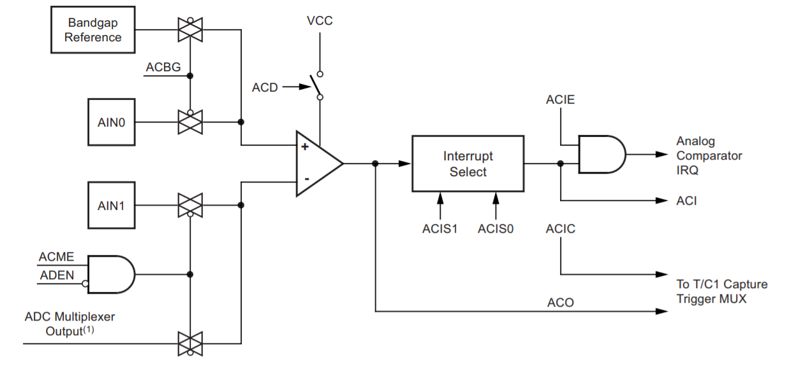
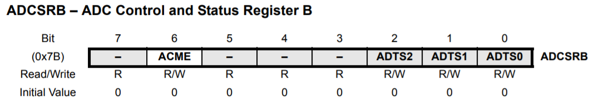
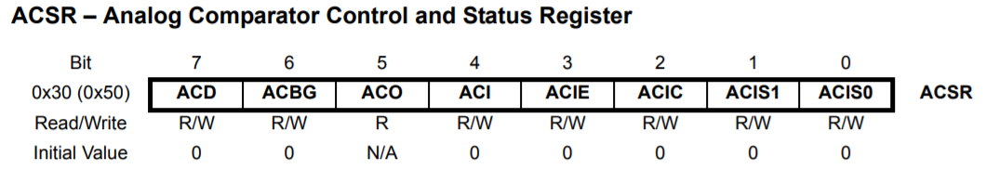
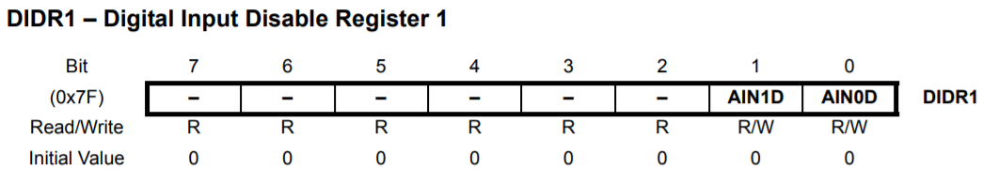

## 7. Comparador

#### 7.1. Diagrama de blocos

    

#### 7.2. Funcionamento

Compara a tensão de positiva de AIN0 com o a negativa de AIN1. Quando a tensão de AIN0 é maior que AIN1 a o bit ACO é ativo.

É possível gerar a interrupção `ANALOG_COMP`.

É possível usar os pinos ADCn no lugar de AIN1, mas nessa caso não é possível utilzar o conversor A/D.

#### 7.3. Registradores

    

    

    

#### [8. Conversor A/D](08-conversor-a-d.md)