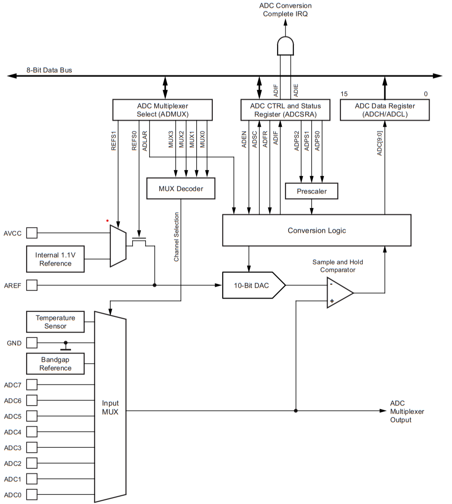
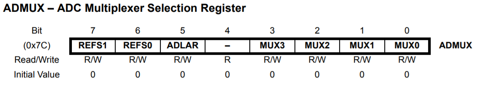
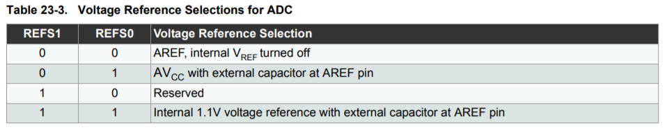
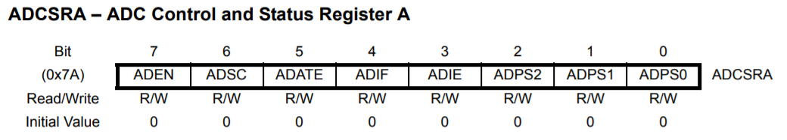
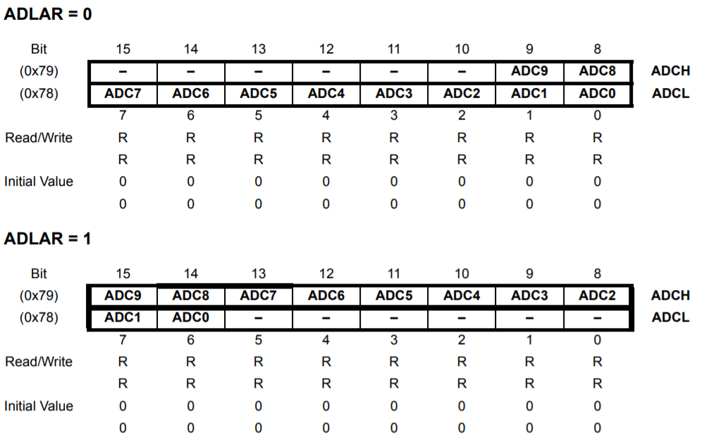
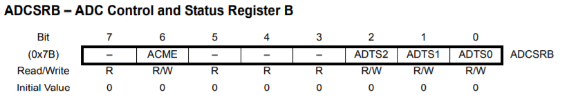
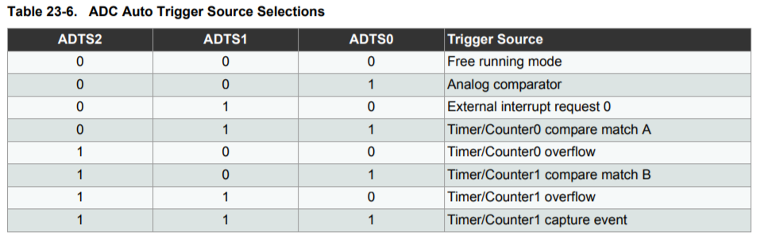
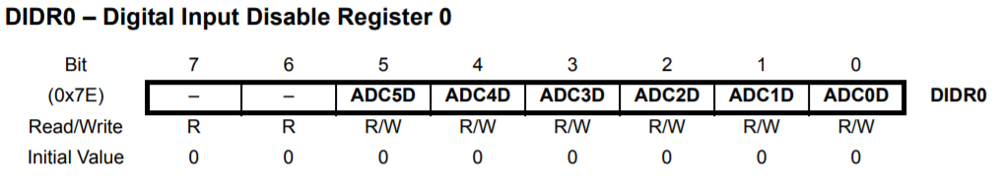

## 8. Conversor A/D

- 10 bits de resolução
- Tempo de conversão: *65 a 260 us*
- 8 canais de entrada
- Frequência de amostragem recomendada: 50KHz a 200 KHz

**Resolução**
``R = Vref / 1024``

#### 8.1. Diagrama de blocos

    

#### 8.2. Funcionamento

Ao setar o bit `ADSC` em `ADCSRA` a converssão é iniciada, ao finalizar o bit `ADIF` e ativado

A interrução `ADC` é chamada após a conclusão caso o bit `ADIE` estiver ativo.

#### 8.3. Registradores

    

    

    

    

    

    

    

