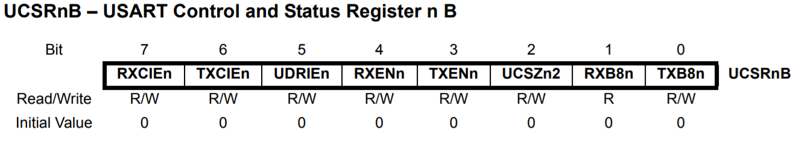

## 9. Comunicação Serial

- Comunicação entre dspositivos
- Protocolos
- Síncrono e Assíncrono
- Velocidade de transmissão

#### 9.1. SPI (Serial Peripheral Interface)

    

#### 9.2. I2C (Inter-Integrated Circuit)

    

#### 9.3. UART (Universal Asynchronous Receiver/Transmitter)

**9.3.1. Baud Rate**

    

**9.3.2. Registradores**

    

    

    

    

    

