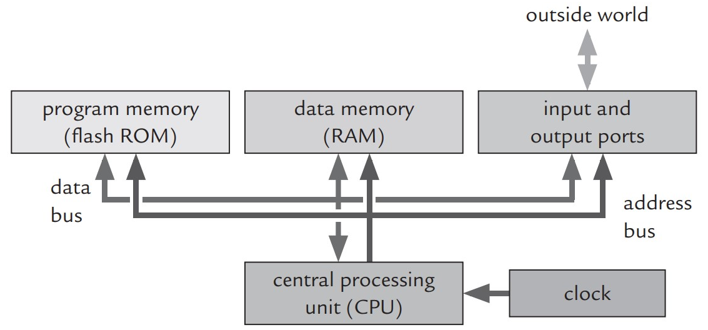

## 1. Introdução à microcontroladores

#### 1.1. O que são?

De maneira prática, um microcontrolador é um pequeno computador capaz de executar instruções pré-programadas, entretanto é construído em apenas um circuito integrado que contém todos os subsistemas necessários para seu  funcionamento, dentre eles a unidade de processamento central (CPU, sigla para Central Processing Unit), a memória e os periféricos programáveis de entrada e saída.

    

#### 1.2. Como funcionam?

#### 1.3. Onde são utilizados?

#### [2. ATmega328p](atmega328p.md)